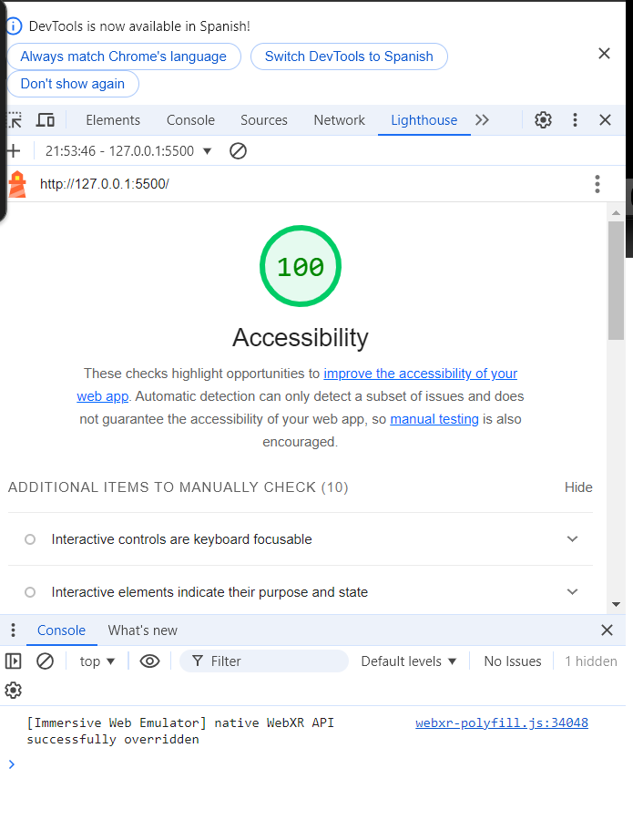

# LABORATORIO 02 - AboutMe

## Descripción del Proyecto

Este proyecto, "AboutMe", es una aplicación diseñada para proporcionar una plataforma interactiva donde los usuarios pueden aprender más sobre mí a través de un juego de preguntas y respuestas. La aplicación pregunta sobre diversos aspectos de mi vida profesional y personal, verificando las respuestas en tiempo real y ofreciendo una experiencia de aprendizaje dinámica y agradable.

### Autor(es)

- Nombre del Estudiante / Grupo

### Tecnologías y Herramientas Utilizadas

- HTML
- CSS
- JavaScript
- Lighthouse para pruebas de accesibilidad

### Puntuación de Accesibilidad de Lighthouse

A continuación, se muestra una captura de pantalla de la puntuación de accesibilidad obtenida mediante Lighthouse, lo que demuestra el compromiso del proyecto con la accesibilidad web.

### Reflexiones y Comentarios

A lo largo del desarrollo de este proyecto, he profundizado en el uso práctico de tecnologías web y he mejorado mi comprensión de la accesibilidad web. Este proyecto no solo reforzó mis habilidades de programación, sino que también me enseñó la importancia de construir aplicaciones accesibles para todos los usuarios.

#### Desafíos Encontrados

- Implementar un sistema de puntuación accesible y comprensible fue un reto que requirió investigación y pruebas.
- Ajustar la aplicación para cumplir con las directrices de accesibilidad.

#### Aprendizajes Clave

- Mejor comprensión de las API de JavaScript para interacciones dinámicas.
- Importancia de la accesibilidad web y cómo implementar técnicas de accesibilidad en proyectos reales.

